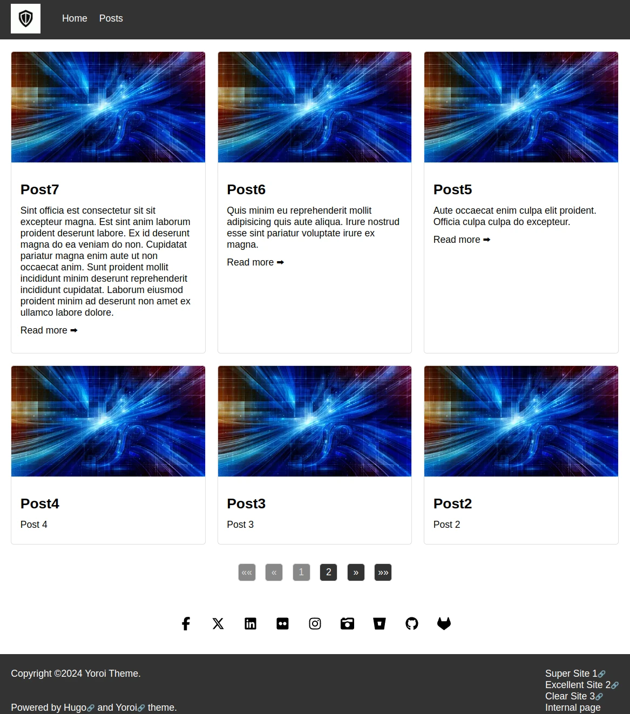
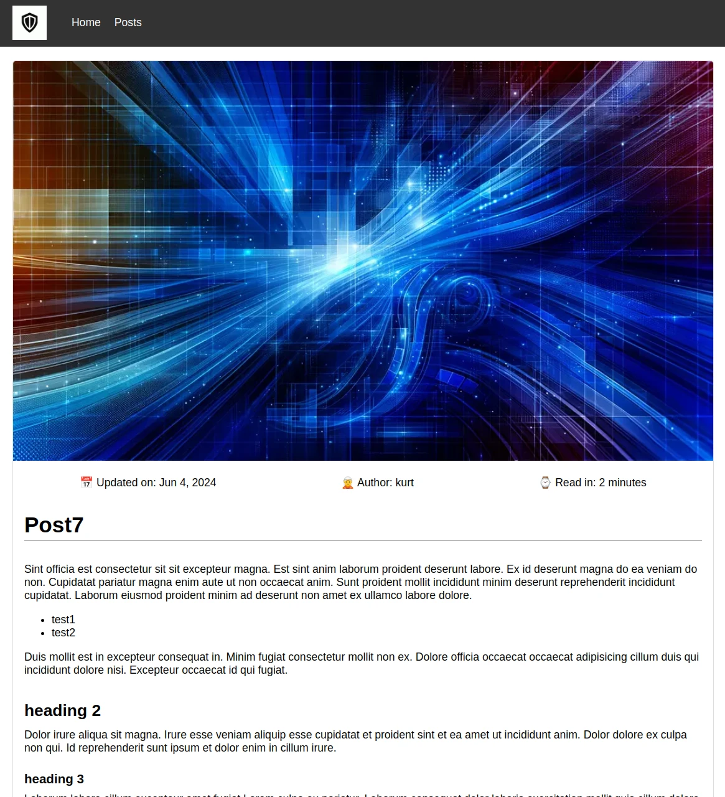

# Yoroi

[](https://opensource.org/licenses/isc)
[](https://fontawesome.com/)
[](https://gohugo.io)

This is just a simple theme for my blog. 

I have used this as a learning experience to get deeper into Hugo. It may still have some rough edges though. 

Issues can be reported here on github.

Tested with Hugo v0.129.0 and v0.148.1, so I would guess version between those are OK too.

## Features

- Home page with three latest posts as cards. Extra content can be added using the `_index.md` file in your content folder.
- Posts page with all posts as cards. Default paging set to 6. This can be changed in the `hugo.toml` file.
- The logo in the navigation can be changed either with the setting in the `hugo.toml` file or overwriting the file in your static folder.
- The default navigation includes an About page.
- Navigation items can be set in `hugo.toml`.
- Footer is set automatically from the site title and current year. 
- Setting `yearStart` in the `hugo.toml` file causes a from year to appear in the footer.
- Social icons are set in a data file and shown just above the footer. Icons are from the free collection of font-awesome.
- The category of a post also defines the blog post image. It uses a default image if no category image can be found. (case sensitive)
- The description field can be used to set the description meta tag of a page. 
- The front matter description setting can be used to set an individual description for each post.
- The cards on the front page and posts page are made clickable using javascript to link to individual posts. It falls back on having normal links if javascript is disabled.
- Links to external sites are located in the right column in the footer. The links are set in a data file.
- External links are marked with 🔗 in both the footer and the post content and will open in new tab/window.
- Admonitions can be added using html tags `note`, `warning`, `error`, `success`. Please note the settings need to allow unsafe content. See settings section.

## Screenshots

The screenshots show the default category image in use.

### Home:


### Posts:



### Single post:



## Installation

Place theme files in the themes folder and set `hugo.toml` to use it with 

```toml
theme = 'yoroi'
```

The blog post images should be placed in the `static/img/category` folder and have the naming convention: `{category}_500.webp` and `{category}_1024.webp`. Please note the category and images are case sensitive. They should be aligned correctly!

The default images are located in the theme folder structure at the same folder location as described above. They can be used as a reference for the naming scheme.

Image sizes used are:

- 500x286 px
- 1024x585 px

## Configuration

### Logo

If you'd like to change the logo it can be set using a custom setting

```toml
[params]
LogoFile = "img/logo.png"
```

### Footer

The footer default contains only the current year but setting yearStart in the `hugo.toml` file to your desired starting year will change the output to have both years in the format yearStart-currentYear (2006-2024).

```toml
[params]
yearStart = ""
```

### Menu

The default main menu is set in the configuration file as well. 

```toml
[[menus.main]]
name = 'Home'
pageRef = '/'
weight = 10

[[menus.main]]
name = 'Posts'
pageRef = '/posts'
weight = 20

[[menus.main]]
name = 'About'
pageRef = '/about'
weight = 30
```

### Author

A default author can be set for all posts using the setting below. An individual author can be set in the frontmatter on each post to define a post author and will overrule the default author.

```toml
[params]
author = 'John Doe'
```

### Date format

This setting will define the date format used in the posts output.

```toml
[params]
dateFormat = "Jan 2, 2006"
```

### Description

A site wide description that will set the meta tag for all pages. Defining a description in the frontmatter of a post will overrule the site wide description.

```toml
[params]
description = ''
```

### Admonitions

To use the admonitions the settings need to include the following snippet. 

```toml
[markup.goldmark.renderer]
unsafe= true
```

Make sure you understand the implications of enabling this! If you are in control of all content it's not a problem, otherwise it could be used to inject malicious html into your posts. (only before the site is build).

### Others

Other settings I use include

```toml
summaryLength = 10
[pagination]
pagerSize = 6
```

I would suggest keeping paginate as a multiplication of 3. e.g. 3, 6, 9 or 12 to keep the grid like layout of the posts.
